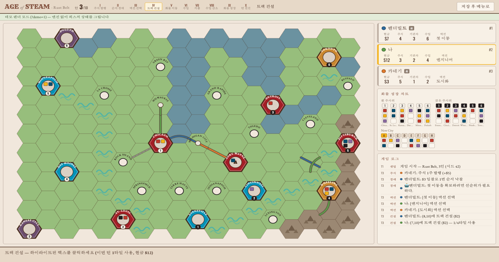

# buildnwrite

**Helping solo builders work smarter than teams with AI — author, educator, and your closest AI mentor**

[🌐 buildnwrite.com](https://buildnwrite.com) · [💼 LinkedIn](https://www.linkedin.com/in/jayjunglim) · [🧵 Threads](https://www.threads.com/@buildnwrite) · [📚 Book](https://www.yes24.com/product/goods/185269651) · [✉️ contact@buildnwrite.com](mailto:contact@buildnwrite.com)

I teach n8n automation and Claude-powered workflows. 400+ one-on-one mentoring sessions, 30+ corporate trainings at Samsung Electronics, LG Electronics, KCC, and more. I'm not called a mentor because I'm brilliant — I'm called a mentor because I made the mistakes first. I don't sell answers; I share perspective.

Currently running [ggplab](https://ggplab.xyz) — writing books, building courses, and running communities. 🇰🇷 Most of my content is in Korean.

---

## 📚 Book

<table>
<tr>
<td width="220" align="center">

</td>
<td>

### 『n8n이 다 해줌』 — *n8n Does It All* (Hanbit Media, 2026)

A Korean book on no-code workflow automation with n8n — from RSS news digests to AI agent workflows, learned by building.

**Buy (KR)** — [YES24](https://www.yes24.com/product/goods/185269651) · [Kyobo](https://product.kyobobook.co.kr/detail/S000219616275) · [Aladin](https://www.aladin.co.kr/shop/wproduct.aspx?ItemId=389930528) · [Hanbit](https://www.hanbit.co.kr/store/books/look.php?p_code=B5287461531)

**Companion repo** — [ggplab/n8n-playbook](https://github.com/ggplab/n8n-playbook) 

**Book trailer** — [YouTube](https://youtu.be/wi1TEGm7CTc)

Next book in progress.

</td>
</tr>
</table>

---

## 🛠 Featured Projects

| Project | What it is | |
|---|---|---|
| [**n8n-playbook**](https://github.com/ggplab/n8n-playbook) | Companion repo for the book — hands-on materials + production automation workflows |  |
| [**solo-biz-playbook**](https://github.com/ggplab/solo-biz-playbook) | The operating playbook of a real one-person business — strategy, time tracking, AI work systems |  |
| [**data-analysis-playbook**](https://github.com/ggplab/data-analysis-playbook) | Runnable data-analysis recipes — product analytics, visualization, statistics, ML |  |
| [**claude-obsidian-knowledgebase**](https://github.com/ggplab/claude-obsidian-knowledgebase) | Auto-capture Claude Code sessions into an Obsidian knowledge base |  |
| [**claude-agentic-study**](https://github.com/ggplab/claude-agentic-study) | Study-group archive for hands-on agentic coding with Claude Code |  |

## 🎲 Side Project

**[AOS Fan-made](https://aos.ggplab.xyz)** — an unofficial, non-commercial web implementation of the train board game *Age of Steam*. Rust Belt and Scotland maps, 3-player games against 2 AI opponents. Built to stress-test AI pair programming on something I love.

---

## ⚙️ Core Stack

## 🧩 Open Source I Use Daily

The projects behind the stack — and where I contribute back.

| Project | How I use it |
|---|---|
| [**diagram-design**](https://github.com/cathrynlavery/diagram-design) | Editorial diagrams straight from Claude Code — every architecture/flow diagram in my books, decks, and research notes. Contributor — CJK font/label support and Mermaid import fixes merged upstream. |
| [**n8n**](https://github.com/n8n-io/n8n) | The automation backbone — self-hosted on a Mac mini, powering my pipelines. Wrote [the book](https://www.yes24.com/product/goods/185269651) on it. |

## 📬 Contact

- Lectures, mentoring, and collaboration — [ggplab.xyz](https://ggplab.xyz)
- LinkedIn — [jayjunglim](https://www.linkedin.com/in/jayjunglim)
- Threads — [@buildnwrite](https://www.threads.com/@buildnwrite)
